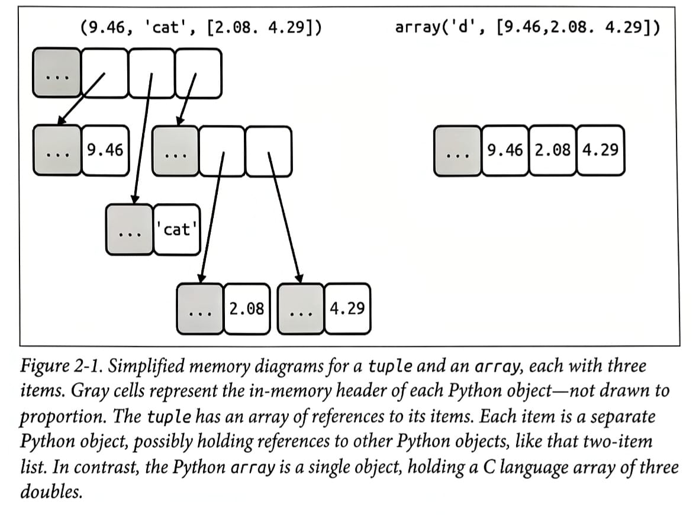
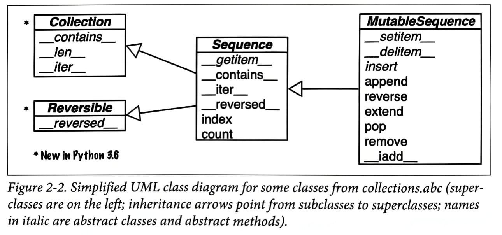

Since, Python inherits from ABC the uniform handling of sequences. Strings, lists, byte sequences, arrays, XML elements and database results they all share a rich set of common operations like iteration, slicing, sorting, and concatenation.

Understanding all this will help us save time and prevents from reinventing the wheel.

## Overview of Built-In Sequences

The standard library offers a rich selection of sequence types implemented in C:

1. _Container Sequences_: Can hold items of different types, including nested containers. Some examples: `list`, `tuple`, and `collections.deque`.
   _Example: `(9.46, 'cat', [2.08, 4.29])`_
2. _Flat Sequences_: Hold items of one simple type. Some examples: `str`, `bytes`, and `array.arrray`. It is more compact, but they are limited to holding primitive machine values like bytes, integers, and floats.
   _Example: `array('d', [9.46, 2.08, 4.29])`_

<p align="center">
  
  <i><small>A container sequence holds references to the objects it contains, which may be of any type.<br>A flat sequence stores the value of its contents in its own memory space, not as distinct Python objects.</small></i>
</p>

3. _Mutable Sequences_: For example, `list`, `bytearray`, `array.array` and `collections.deque`.
4. _Immutable sequences_: Fot example, `typle`, `str`, and `bytes`.

> [!IMPORTANT]
> - Mutable sequences inherit all methods from immutable sequences, and implement several additional methods.
> - Common traits: mutable versus immutable, container versus flat.

<p align="center">
  
  <i><small>A container sequence holds references to the objects it contains, which may be of any type.<br>A flat sequence stores the value of its contents in its own memory space, not as distinct Python objects.</small></i>
</p>

Every Python object in memory has a header with metadata. The simplest Python object, a float, has a value field and two metadata fields:

- `ob_refcnt`: the objet's reference count
- `ob_type`: a pointer to the object's type
- `ob_fval`: a C double holding the value of the float

## List Comprehensions and Generator Expressions
A quick way to build a sequence is using a list comprehension (if the target is a list) or a generator expression (for ther kinds of sequence).

Python programmers refer to list comprehensions as `listcomps`, generator expressions as `genexps`.

#### List comprehensions and Readability
A `for` loop may be used to do lots of different things: scanning a sequence to count or pick items, computing aggregates (sums, averages), or any number of other tasks.

_Example: Build a list of Unicode code points from a string_
```python
symbols = "!@#$%"
codes = []
for symbol in symbols:
    codes.append(ord(symbol))
print(codes)
>>> [33, 64, 35, 36, 37]
```
_Example: Build a list of Unicode code points from a string, using a listcomp_
```python
symbols = "!@#$%"
codes = [ord(symbol) for symbol in symbols]
print(code)
>>> [33, 64, 35, 36, 37]
```
#### Local Scope Within Comprehensions and Generator Expressions
In Python 3, list comprehensions, generator expressions, and their siblings set and dict comprehensions, have a  local scope to hold the variables assigned in the for clause.
However, variables assigned with the "Walrus Operator" := remain accessible after those comprehensions or expressions return -- unlike local variables in a function.
```python
x = "ABC"
codes = [ord(x) for x in x]
print(x)
>>> "ABC"
print(codes)
>>> [65, 66, 67]
codes = [last := ord(c) for c in x]
print(last)
>>> 67
print(c)
>>> "NameError: name 'c' is not defined"
```

> [!IMPORTANT]
> Walrus expression (:=) works when you're assigning and checking in the same expression
> ```python
> # Walrus expression doesn't work in this type of situation
> count = 0
> for item in my_list:
>     if item == x:
>         count += 1
> ```
> ```python
> # Here variable is assigned and checked in the same expression.
> if count:= my_list.count(x):
>     count += 1
> ```


